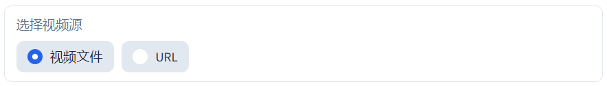
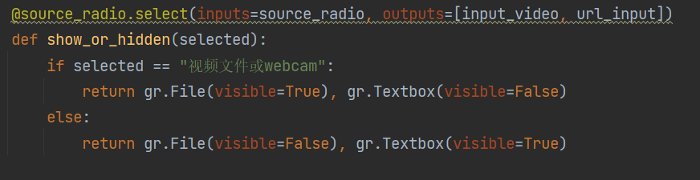
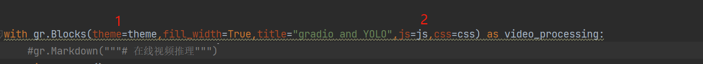

**欢迎各位同学 or 大佬关注vx公众号"观智能"~ 作者会不定期更新技术文章~**


## 功能

- 本地及网络视频[RTSP|RTMP|IP|...]推理
- 推理结果实时展示
- 模型推理参数配置
- 模型选择
- 推理结果本地保存
- 相关参数展示

## 快速开始

### 环境要求
- Python 3.8+
- 支持CUDA的GPU (可选，用于加速推理)

### 安装和运行

#### 方法1: 使用启动脚本 (推荐)
```bash
python run.py
```
启动脚本会自动:
- 检查Python版本
- 安装所需依赖
- 下载YOLO模型
- 启动Web服务

#### 方法2: 手动安装
```bash
# 安装依赖
pip install -r requirements.txt

# 运行应用
python interface.py
```

### 访问应用
运行成功后，在浏览器中访问: http://127.0.0.1:9993

## 使用说明

### 支持的视频源
1. **本地视频文件**: 上传MP4、AVI、MOV等格式的视频文件
2. **摄像头**: 使用本地摄像头进行实时推理 (输入设备ID，如0)
3. **网络流**: 支持RTSP、RTMP、HTTP等网络视频流

### 模型选择
- yolo11n: 最快，精度较低
- yolo11s: 平衡速度和精度
- yolo11m: 中等速度，较高精度
- yolo11l: 最慢，最高精度

### 参数调节
- **置信度**: 检测结果的置信度阈值 (0-1)
- **IoU阈值**: 非极大值抑制的IoU阈值 (0-1)
- **目标类别**: 指定检测的类别ID (留空检测所有类别)
- **保存结果**: 是否将推理结果视频保存到本地

## 关键点

- **YOLO11的使用**

  调用Ultralytics的库，而不是开源代码

  ```python
  model = YOLO("yolo11n")
  ```

  注意，stream=True,即使用生成器(generator)，而不是一下子返回所有结果

  ```python
  results = model(....,stream=True)
  ```

  每一帧的推理结果要将CV2的BGR通道顺序转为PIL的RGB，因为Gradio默认处理图片的通道顺序是RGB

  ```python
  result = result[:, :, ::-1]
  ```

- **页面如何布局？**

  **概括**：最外层为gr.Blocks，在gr.Blocks之内，嵌套容器组件或者放置功能性组件。容器组件通过**with**上下文管理器的格式书写。

  如下图：

  

- **搞懂处理函数**

  处理函数可以接收用户在页面交互时产生的数据，并且返回数据来更新组件的值。

  如下例子所示，inference接收a,b,c,d四个前端组件传来的值，并将处理结果返回给m,n两个组件。

  ```python
  def inference(a,b,c,d):
      ...
      return m,n
  ```

  调用处理函数有两种方式，一是作为事件的实参直接传递，注意inputs和outputs组件的顺序和函数参数及返回值的顺序要一致：

  ```python
  button.click(fn=inference,inputs=[a,b,c,d],outputs=[m,n])
  ```

  二是在定义时被事件装饰器装饰：

  ```Python
  @button.click(inputs=[a,b,c,d],outputs=[m,n])
  def inference(a,b,c,d):
      ...
      return m,n
  ```

- **如何更新组件属性？**

  处理函数中讲过函数的返回值将用来更新对应组件的值，但当处理函数返回组件时，这个被返回的组件的属性将更新对应组件的属性：

  

  比如在选择视频源时，点击视频文件按钮，就会跳出文件上传面板，而点击URL按钮就会隐藏文件上传面板并显示URL输入框。这是通过组件的visible属性做到的，如下图：

  

  对应组件的其他属性不会受到影响。

- **如何定制样式？**

  

  可以使用Gradio的默认theme对象以及自定义theme对象；支持自定义css、js、HTML，以字符串或文件路径的形式传递给gr.Bolcks。在gr.Blocks中的组件可以使用其中的样式，如：

  ```python
  button = gr.Button(elem_id="xxx")
  ```

- **如何接收或输出流数据？**

  比如目标检测的结果实时地展现在页面上，这意味着页面上的对应组件要不断地接收新的数据，做到这一点，只需要将普通的处理函数变成**生成器**，如下：

  ```Python
  def video_inference(i1,i2,...):
      ...
      yield o1,o2,o3,..
  ```


  本案例是将每张处理后的帧yield给一个gr.Image组件，组件上的画面不断更新，所以就形成了视频。

  官方的解决方案是将n帧保存为一段短视频，然后将短视频yield给gr.Video组件，我觉得这样做有些鸡肋，没有采用。

- **考虑到篇幅，更多细节问题就不再讨论啦~ 欢迎各位小伙伴@作者**

http://211.86.197.10:9084/lab/tree/coursework/%E5%9F%BA%E4%BA%8EGradio%E5%92%8CUltralytics%E7%9A%84%E5%9C%A8%E7%BA%BF%E8%A7%86%E9%A2%91%E6%8E%A8%E7%90%86%E7%B3%BB%E7%BB%9F