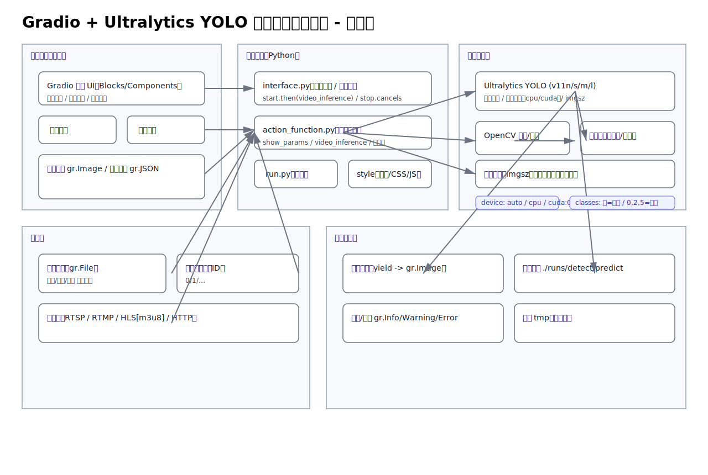

# 🚀 Gradio YOLO 视频推理系统使用指南

## 📋 系统概述

这是一个基于Gradio和Ultralytics YOLO的在线视频推理系统，支持多种视频源的实时目标检测。

## 🛠️ 快速启动

### 1. 环境准备
确保您的系统满足以下要求：
- Python 3.8+
- 足够的内存 (建议8GB+)
- GPU (可选，用于加速推理)

### 2. 安装依赖
```bash
pip install -r requirements.txt
```

### 3. 启动系统
推荐使用启动脚本：
```bash
python run.py
```

或者直接运行：
```bash
python interface.py
```

### 4. 访问界面
打开浏览器访问：http://127.0.0.1:9993

## 📖 功能说明

### 视频源选择
1. **视频文件**
   - 支持格式：MP4, AVI, MOV, MKV等
   - 点击"选择视频源"选择"视频文件"
   - 上传本地视频文件

2. **摄像头**
   - 支持USB摄像头和内置摄像头
   - 选择"摄像头"选项
   - 输入设备ID (通常是0，如有多个摄像头可尝试1,2...)

3. **网络流**
   - 支持RTSP、RTMP、HTTP流
   - 选择"URL"选项
   - 输入完整的流地址，例如：
     - RTSP: `rtsp://username:password@ip:port/path`
     - HTTP: `http://ip:port/stream.mjpg`

### 模型配置
- **模型选择**：根据性能需求选择合适的模型
  - yolo11n: 速度最快，精度较低
  - yolo11s: 平衡选择
  - yolo11m: 中等精度
  - yolo11l: 精度最高，速度较慢

### 参数调节
- **置信度阈值** (0-1)：控制检测结果的可信度
- **IoU阈值** (0-1)：控制重叠检测框的过滤
- **目标类别**：指定检测类别ID，留空检测所有类别
- **保存结果**：是否将推理结果保存为视频文件

## 🔧 故障排除

### 常见问题

1. **模型加载失败**
   - 检查网络连接，首次运行需要下载模型
   - 确保有足够的磁盘空间

2. **摄像头无法打开**
   - 检查摄像头是否被其他程序占用
   - 尝试不同的设备ID (0, 1, 2...)
   - 确保摄像头驱动正常

3. **网络流连接失败**
   - 检查URL格式是否正确
   - 确认网络流服务正常运行
   - 检查防火墙设置

4. **推理速度慢**
   - 使用较小的模型 (yolo11n)
   - 确保GPU驱动和CUDA正确安装
   - 降低输入视频分辨率

### 性能优化建议

1. **GPU加速**
   ```bash
   # 安装CUDA版本的PyTorch
   pip install torch torchvision --index-url https://download.pytorch.org/whl/cu118
   ```

2. **内存优化**
   - 关闭不必要的程序
   - 使用较小的模型
   - 减少批处理大小

## 📊 系统测试

运行测试脚本检查系统状态：
```bash
python test_system.py
```

## 🆘 技术支持

如遇到问题，请：
1. 查看控制台错误信息
2. 检查系统日志
3. 参考GitHub项目页面的Issues
4. 联系技术支持

---

## 架构图

下图为系统架构示意（直接在项目中已生成，可本地双击打开查看）：



**享受您的AI视频推理体验！** 
